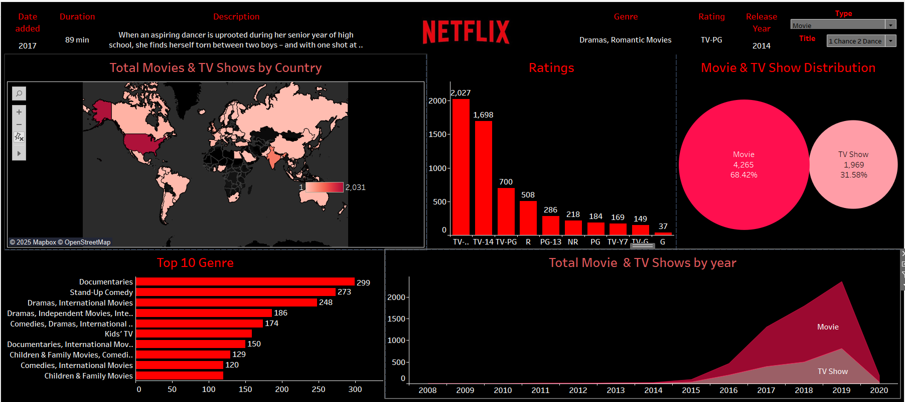

# 📊 Netflix Data Analysis Dashboard (Tableau)

## 📌 Overview
This project is a **Netflix Data Analysis Dashboard** built using **Tableau** to analyze trends in Netflix movies and TV shows. The dashboard provides insights into movie & TV show distribution, ratings, genres, and country-wise data.

## 🖼️ Dashboard Preview


## 🔥 Features
- **Total Movies & TV Shows by Country** 🌍
- **Ratings Distribution** 📊
- **Top 10 Genres Analysis** 🎭
- **Total Movies & TV Shows by Year** 📅
- **Movie & TV Show Distribution (Pie Chart)** 📈

## 📂 Project Structure
```
/Netflix-Data-Analysis
│── 📊 Netflix_Dashboard.twb (Tableau Workbook)
│── 📁 Data (CSV, Excel files)
│── 📜 README.md
│── 📷 image.png (Dashboard Screenshot)
```

## 🚀 How to Use
1. Clone the repository:
   ```sh
   git clone https://github.com/khushipandey-15/Netflix-Data-Analysis.git
   ```
2. Open `Netflix_Dashboard.twb` in **Tableau Desktop**.
3. Load the dataset (`CSV/Excel`).
4. Explore and analyze Netflix insights.

## 📌 Requirements
- **Tableau Desktop**
- **Netflix Movies & TV Shows Dataset** (CSV/Excel)

## 💡 Insights from the Dashboard
- **Movies (68.42%)** dominate Netflix content, while **TV Shows (31.58%)** form a smaller proportion.
- The **USA** has the highest number of Netflix content available.
- **Documentaries & Stand-up Comedy** are among the most popular genres.
- A significant rise in Netflix content was observed from **2016 to 2019**.

## 🏆 Contribution
Feel free to contribute by:
- Enhancing the dashboard
- Adding new insights
- Improving data visualizations

## 📜 License
This project is for educational purposes. Feel free to modify and use it.

---

💡 **Developed by [Your Name]**  
🔗 **GitHub:** [khushipandey-15](https://github.com/khushipandey-15)
